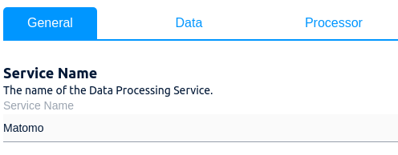

# SNK Usercentrics Magento 2 Integration

**Extension for Magento 2**

## Overview

**TODO**

## Requirements

Magento 2.3.*, PHP >7.1

## Installation

Install with composer:

 ```
 composer require snk/magento2-module-usercentrics
```

## Configuration details

Go to `Stores->Configuration->Snk->Usercentrics`

* _Enable_ - enable of disable module for scope.
* _Settings ID_ - the configuration ID from your Usercentrics account.
* _Enable Smart Data Protector_ - enable <a target="_blank" href="https://docs.usercentrics.com/#/smart-data-protector">Usercentrics Smart Data Protector </a>.
* _Enable Page Reload After Consent Revoked_ - reload page if user revokes a consent.
* _Script URL_ - usercentrics script URL. It should not but may change.
* _Selectors_ - configuration which decides which parts of Magento application must be processed.

#### Selectors

_Cookie group_ of each selector corresponds to separate service names under _Data Processing Services_.

For example, here it's "Matomo":




There are three types of selectors:
 - block
 - template
 - regex
 
 The module iterates through the output of Magento blocks and tries to match them against the selectors.

_Block_ selectors look for magento block name in layout.

_Template_ selectors look for HTML from specific templates.

_Regex_ selectors are the most flexible and the most dangerous type, they try to match every block against the configured regexp.

## Integration 

The module adjusts `<script>` tags in selected blocks of HTML output by changing `type` to `text/plain` and adding `data-usercentrics` attribute with the cookie group.

Some magento scripts are initialized in a declarative way,  for example:
```
<!--- Won't work with Usercentrics -->
<script type="text/x-magento-init">
    {
        "*": {
            "Vendor_Module/js/some-cool-script": {
                "config": "value"
            }
        }
    }
</script>
```

Unfortunately Usercentrics cannot set script type back to `x-magento/init` so such calls must be done imperatively in order for Usercentrics to function properly. 

So the above should be rewritten like this:
```
<!--- Will work with Usercentrics -->
<script type="text/javascript">
    require([
        'jquery',
        'mage/apply/main'
    ], function ($, mage) {
        $(function () {
            mage.applyFor(
                '*',
                {
                    "config": "value"
                },
                'Vendor_Module/js/some-cool-script',
            );
        });
    });
</script>
```
## Authors

Oleh Kravets <a href="mailto:oleh.kravets@snk.de">oleh.kravets@snk.de</a>

## Lisence

MIT